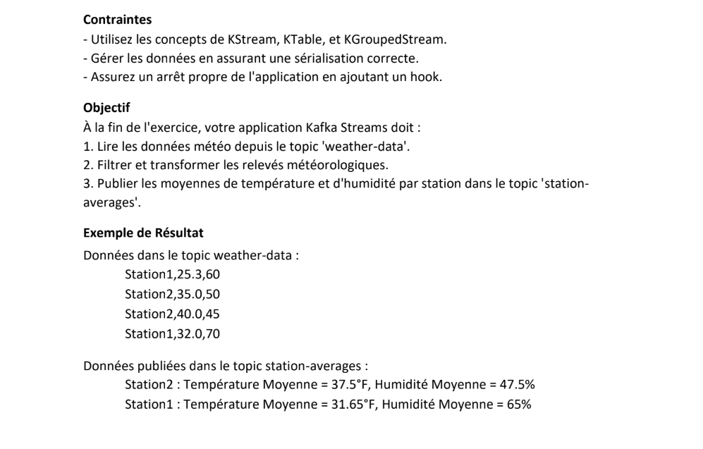
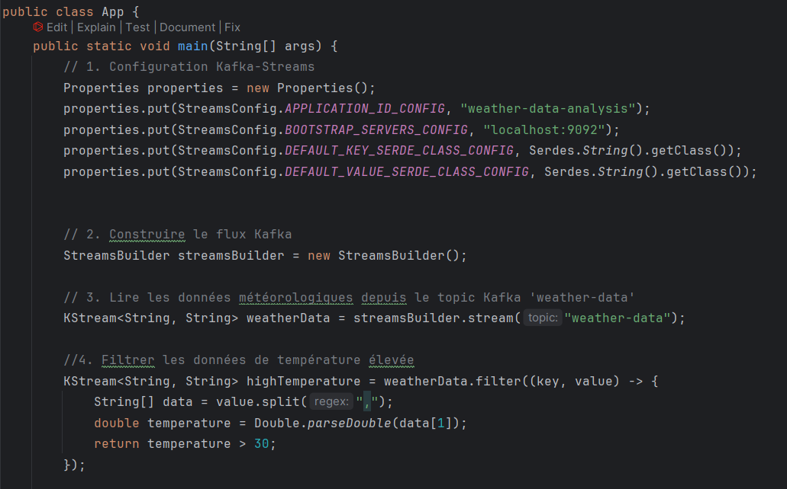
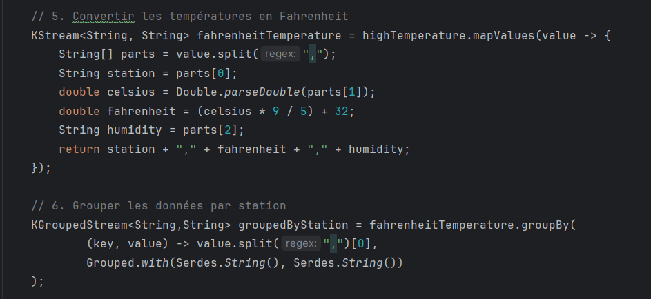
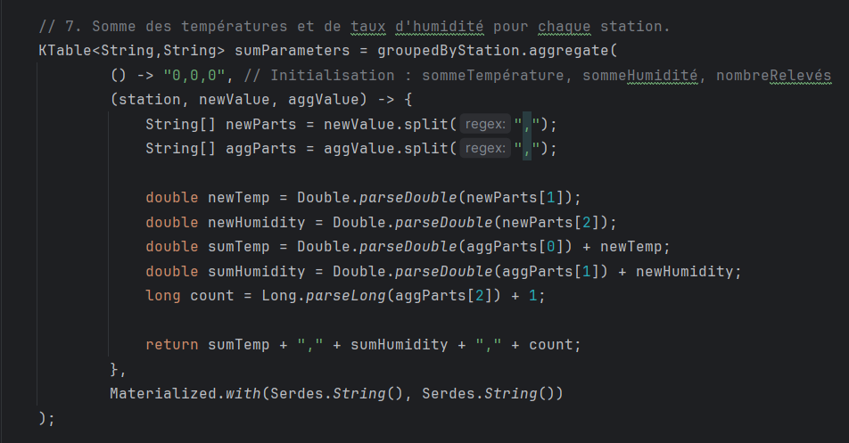
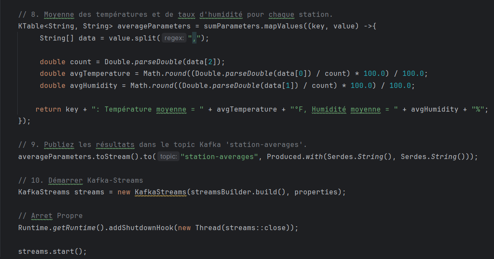
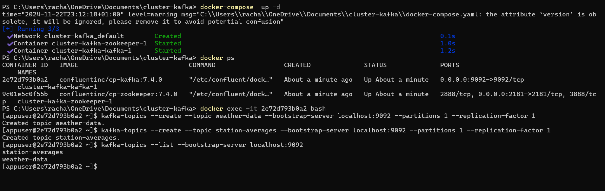
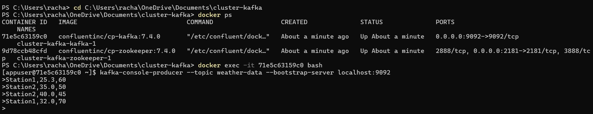
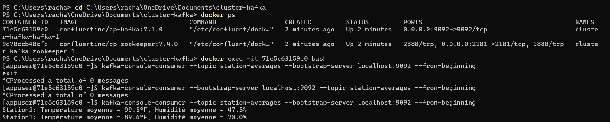

<h1 align="center" >TP 1: Kafka Streams</h1>

<h1>Exercice 1 : Analyse de Données Météorologiques</h1>

<h2>
  1.  Configuration Kafka-Streams  
  2. Construction de flux Kafka  
  3. Lecture des données météorologiques depuis le topic Kafka 'weather-data'  
  4. Filtrer des données de température élevée  
</h2>

<h2>
  5. Convertion des températures en Fahrenheit  
  6. Groupement de sdonnées par station  
</h2>

<h2>7. Somme des températures et de taux d'humidité pour chaque station. </h2>

<h2>
  8. Moyenne des températures et de taux d'humidité pour chaque station.  
  9. Publiez les résultats dans le topic Kafka 'station-averages'.  
  10. Démarrer Kafka-Streams  
</h2>

<h2>Démarrage Kafka et Création de Topics</h2>

<h2>Ecriture de données sur "weather-data"</h2>

<h2>Affichage de résultats sur "station-averages"</h2>

